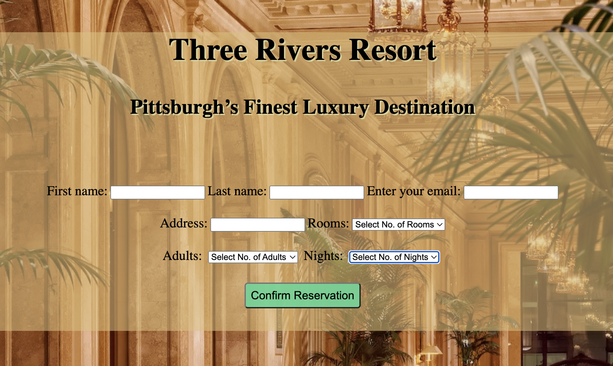

# hotel_booking_app

 A hotel booking form for a fictitious hotel called “Three Rivers Resort”. 
 Languages Used:  HTML & CSS

View it [here](https://jmurrii.github.io/hotel_booking_app/)

## Summary
In the second exercise of Andy Sterkowitz' Software Development Mastermind Program, I was given the task of creating a hotel booking form application.
It required me to learn all about HTML forms and HTML/browser Form validation.
I also learned more about CSS, namely flexbox and layouts.

## Author
John Murray - Software Developer (...in training :)
